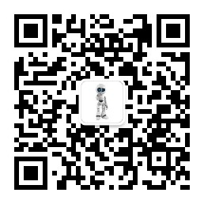

## 微信公众号

 
 

***
## Mainstream open source SLAM framework
### Visual SLAM
[MonoSLAM](monoslam)

[PTAM](ptam)

[ORB-SLAM](orb-slam)

[LSD-SLAM](lsd-slam)

[SVO](svo)

[VINS-Mono](vins-mono)

[S-MSCKF](s-msckf)

### Lidar SLAM
[LOAM](loam)

[GMapping](gmapping)
